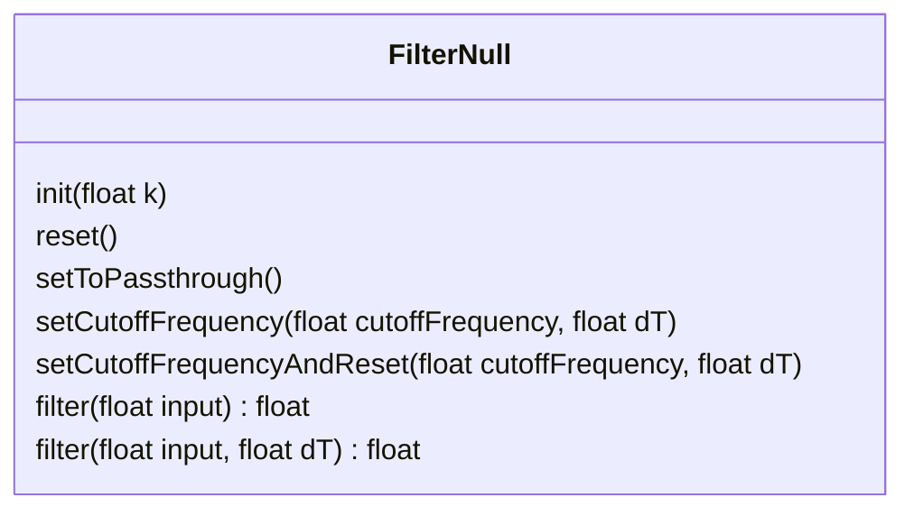
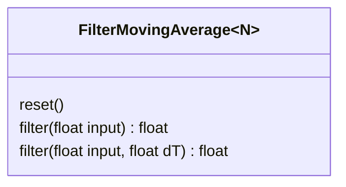
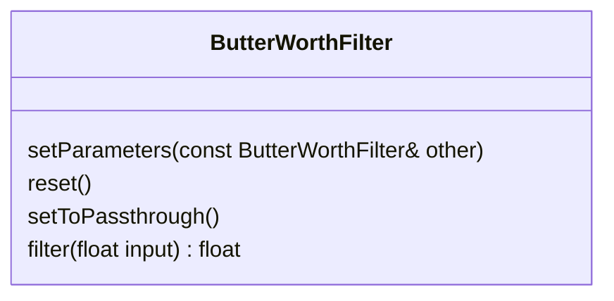
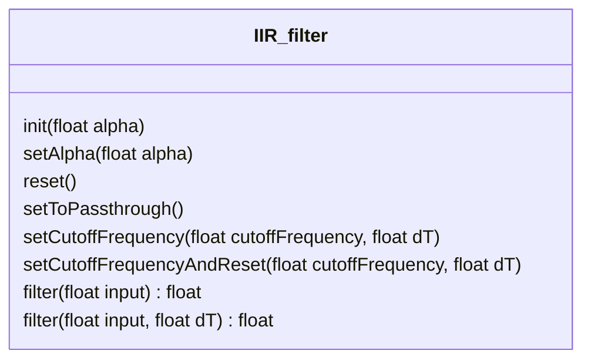
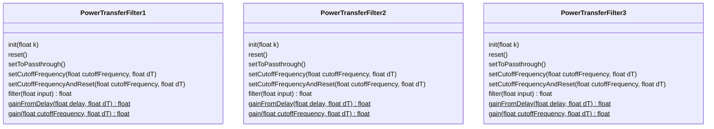
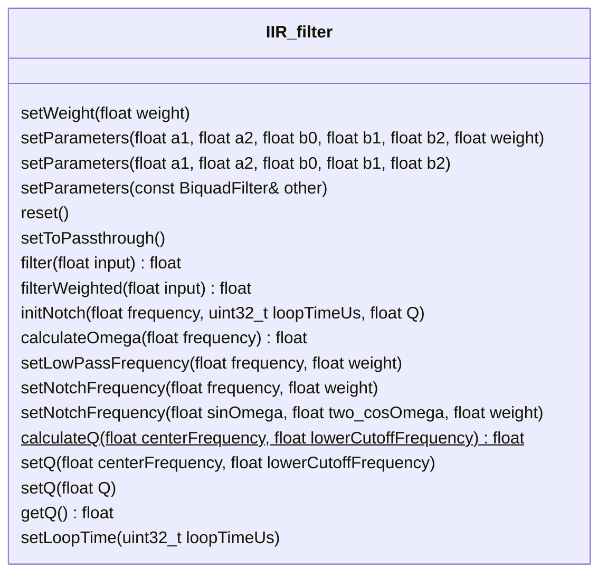

 

# Filters Library

This library contains a collection of filter classes. They have been developed for use in a Self Balancing Robot and have been used to:

1. Filter gyro and accelerometer output for use in the Attitude and Heading Reference System (AHRS).
2. Filter motor encoder values for use in the motor controller.
3. Filter derivative terms in a PID controller.
4. Filter motor power input values to smooth the motor speed.

## Class Diagram

The filters are somewhat statically (build-time) polymorphic, but not dynamically (run-time) polymorphic. 
This is deliberate. 
The filters have functions that have names and signatures in common, but these functions are not virtual. 
This means the the filters are somewhat interchangeable at build time, depending on which functions are used

